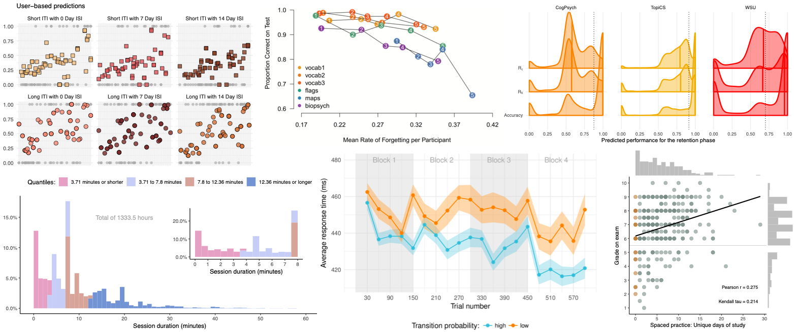

I am a contractor through [Infinite Tactics](https://infinitetactics.com/www/) working on computerized, adaptive learning with Tiffany Jastrzembski/Myers's team at the [Air Force Research Laboratory at Wright-Patterson](https://www.wpafb.af.mil/afrl/711HPW/). Together with [Hedderik van Rijn](https://van-rijn.org/), I co-supervise two PhD students at the University of Groningen: [Maarten van der Velde](https://www.maartenvandervelde.com/) and [Thomas Wilschut](https://www.thomaswilschut.com/).

This website gives an overview of the peer-reviewed academic work I have (co-)authored, my CV, and my company *Sense Data Science*. Please use the menu above to find what you are interested in.

For any questions you might have, please use the "contact me" button in the top right corner to get in touch.

<!--  -->

  

-----

-----

<!-- 
  
 -->